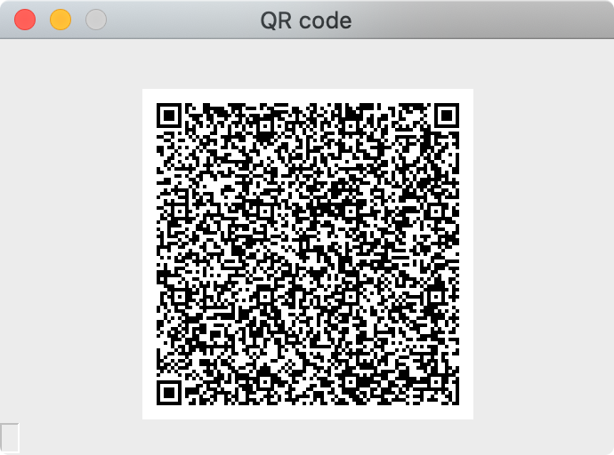

# qr-backup

The purpose of this project is to establish a more secure alternative to paper backups while keeping the content of backups as interoperable* as possible.

*Using GnuPG is not the most secure option given SHA512 is (more) vulnerable to brute-force attacks (using Argon2, for example, would be more secure, but would require using code to access backups vs simply piping the output of the QR code to `gpg` making backups less interoperable).

This above thought process is open for debate (see [issues](https://github.com/sunknudsen/qr-backup/issues/1)).

## The following is a proof-of-concept that requires work.

The following example can be used to create an encrypted paper backup of a Bitcoin BIP39 12-word mnemonic.

```console
$ echo "essence wisdom demise insane vital kitchen pet swarm robust warfare innocent dolphin" | gpg --s2k-mode 3 --s2k-count 65011712 --s2k-digest-algo sha512 --cipher-algo AES256 --symmetric --armor | pipenv run python main.py
-----BEGIN PGP MESSAGE-----

jA0ECQMKimEkkEvcaGL/0oQB6Z/YDrznKURYHKjpg13Oh6yEF9gCJs2ZqisB7THv
c5bfCJGL+wHBuZTzA27hLMyW/EYOHO21HUng+MJiSPBvqjC+Gft/OzO7DudqR/WL
ZqfjMVvhTnNxEQWqF2E7Di2njXMXB/WgPZgMttP4syyshZmUOGE03QqT97jwYoM5
ndF/pAk=
=i95a
-----END PGP MESSAGE-----
```

**Displayed QR code**



## Requirements (also open for debate)

- Secure by design (dependability)
- Runs on Python (increased interoperability)
- Runs on Raspberry Pi (affordability, cold* computing, compartmentalization and Intel SE mitigation)
- As few dependencies as possible (increased interoperability and easy code audits)
- Framebuffer support on [Raspberry Pi OS (32-bit) Lite](https://www.raspberrypi.org/downloads/raspberry-pi-os/) (does not require desktop environment)
- Memory implementation (does not require filesystem)

*Once configured, Bluetooth and Wi-Fi are disabled.

```shell
echo "dtoverlay=disable-bt" | sudo tee -a /boot/config.txt
echo "dtoverlay=disable-wifi" | sudo tee -a /boot/config.txt
sudo reboot
```

## To do (also open for debate)

- Figure out how to display QR code using framebuffer without writing file to filesystem (leading to removal of `opencv-python` dependency which currently doesn’t work on Raspberry Pi OS (32-bit) Lite without multiple additional apt installs)
- Figure out how to display QR code using framebuffer on desktop environments such as macOS